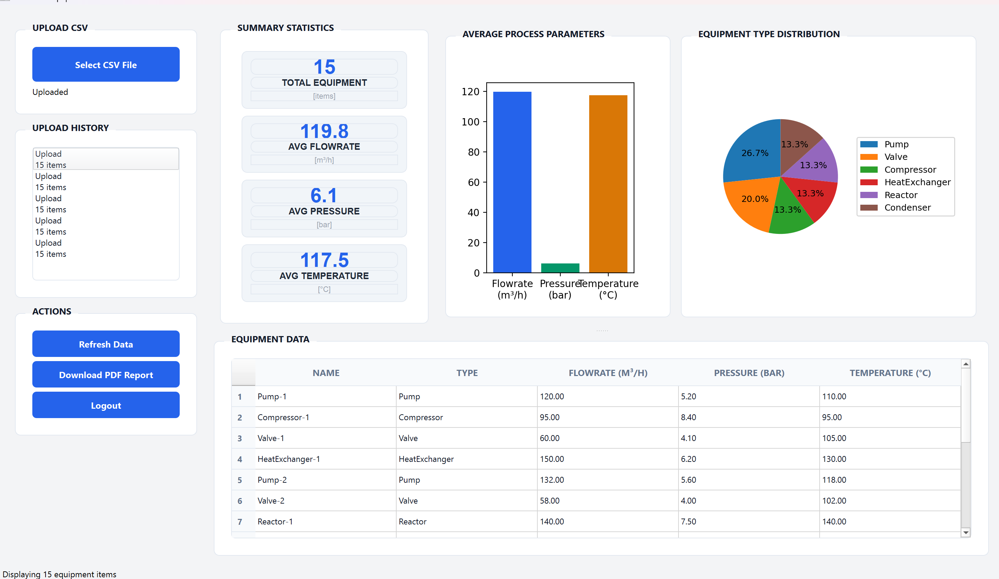
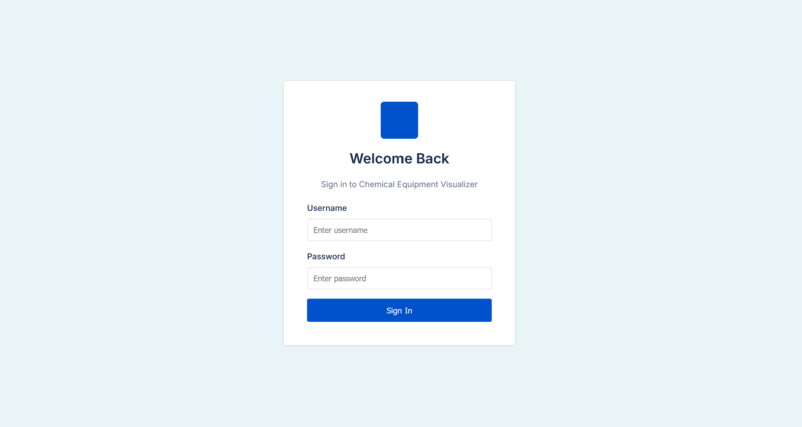

# Chemical Equipment Visualizer

A comprehensive, modular system for uploading, processing, analyzing, and visualizing chemical equipment data with support for web-based access, desktop usage, and automated PDF report generation.

The project emphasizes clean architecture, robustness, and transparency, with a clear separation of concerns between backend and frontend components.

---

## Project Overview

## Screenshots

### Web Frontend (React)


### Desktop Application (PySide6)



### Login Page- authentication



The system consists of three clearly separated, independently deployable components:

- **Backend (Django REST API)**
  Handles CSV ingestion, validation, data processing, statistical aggregation, persistence, and PDF report generation.

- **Web Frontend (React)**
  Browser-based interface for uploading data, viewing summaries, and visualizing results with interactive charts.

- **Desktop Application (PySide6)**
  Standalone desktop client for local usage, communicating with the same backend API to ensure consistent business logic.

This architecture ensures scalability, maintainability, and multiple access modes without duplicating core functionality.

---

## Prerequisites

Ensure the following tools are installed:

- **Python** 3.8 or higher
- **Node.js** 16 or higher
- **pip** (Python package manager)
- **npm** (Node package manager)
- **Git** (version control)

---

## Backend Setup (Django REST API)

### Step 1: Navigate to Backend Directory

```bash
cd backend/equipment_backend
```

### Step 2: Create and Activate Virtual Environment

**Windows:**
```bash
python -m venv venv
venv\Scripts\activate
```

**macOS / Linux:**
```bash
python3 -m venv venv
source venv/bin/activate
```

### Step 3: Install Dependencies

```bash
pip install -r requirements.txt
```

### Step 4: Apply Database Migrations

```bash
python manage.py migrate
```

### Step 5: (Optional) Create Admin User

```bash
python manage.py createsuperuser
```

### Step 6: Run Development Server

```bash
python manage.py runserver
```

The backend will be available at: **http://localhost:8000**

### Key API Endpoints

| Method | Endpoint | Description |
|--------|----------|-------------|
| POST | `/api/upload/` | Upload and process CSV file |
| GET | `/api/history/` | Fetch upload history |
| GET | `/api/summary/<session_id>/` | Retrieve computed statistics for a session |
| GET | `/api/download/<session_id>/` | Download PDF report |

---

## Web Frontend Setup (React)

### Step 1: Navigate to Frontend Directory

```bash
cd frontend
```

### Step 2: Install Dependencies

```bash
npm install
```

### Step 3: Configure Backend API (if required)

Edit `src/services/api.js` and set the API base URL:

```javascript
const API_BASE_URL = 'http://localhost:8000/api';
```

### Step 4: Start Development Server

```bash
npm start
```

The web interface will open at: **http://localhost:3000**

### Step 5: Production Build (Optional)

```bash
npm run build
```

### Features

- CSV file upload with validation
- Interactive charts and data visualization
- Equipment statistics and summaries
- Upload history tracking
- PDF report download capability
- Responsive, professional UI design

---

## Desktop Application Setup (PySide6)

### Step 1: Navigate to Desktop Frontend Directory

```bash
cd desktop-frontend
```

### Step 2: Create and Activate Virtual Environment

**Windows:**
```bash
python -m venv venv
venv\Scripts\activate
```

**macOS / Linux:**
```bash
python3 -m venv venv
source venv/bin/activate
```

### Step 3: Install Dependencies

```bash
pip install PySide6 requests pandas matplotlib
```

### Step 4: Configure Backend API

Edit `main.py` and set the API base URL:

```python
API_BASE_URL = "http://localhost:8000/api"
```

### Step 5: Run Desktop Application

```bash
python main.py
```

### Features

- Standalone desktop application (no browser required)
- CSV file upload via file dialog
- Equipment summaries and type distributions
- Upload history management
- PDF report download
- Shared backend with web frontend

---

## Technology Stack

### Backend

- **Django** 5.0+ – Web framework
- **Django REST Framework** – API development
- **SQLite / PostgreSQL** – Database
- **Pandas** – Data processing
- **Matplotlib** – Charting
- **ReportLab** – PDF generation

### Web Frontend

- **React** 19+ – UI framework
- **Tailwind CSS** – Styling
- **Chart.js** – Interactive charts
- **Lucide React** – Icons

### Desktop Application

- **PySide6** – Qt for Python
- **Requests** – HTTP client
- **Pandas** – Data manipulation
- **Matplotlib** – Visualization

---

## Running the Complete System

To run all three components simultaneously, open three separate terminals:

**Terminal 1 – Backend:**
```bash
cd backend/equipment_backend
venv\Scripts\activate
python manage.py runserver
```

**Terminal 2 – Web Frontend:**
```bash
cd frontend
npm start
```

**Terminal 3 – Desktop Application:**
```bash
cd desktop-frontend
venv\Scripts\activate
python main.py
```

---

## Project Structure

```
chemical-equipment-visualizer/
├── backend/
│   └── equipment_backend/
│       ├── api/
│       │   ├── models.py              # Database models and schema
│       │   ├── views.py               # API endpoints and business logic
│       │   ├── urls.py                # URL routing configuration
│       │   ├── pdf_utils.py           # PDF report generation
│       │   ├── tests.py               # Unit and integration tests
│       │   └── migrations/            # Database migrations
│       ├── equipment_backend/
│       │   ├── settings.py            # Django configuration
│       │   ├── asgi.py                # ASGI application
│       │   ├── wsgi.py                # WSGI application
│       │   └── urls.py                # Project-level URL routing
│       ├── requirements.txt           # Python dependencies
│       ├── manage.py                  # Django management script
│       └── db.sqlite3                 # Development database
├── frontend/
│   ├── src/
│   │   ├── components/                # Reusable React components
│   │   ├── pages/                     # Page-level components
│   │   ├── services/                  # API service layer
│   │   ├── App.js                     # Main application component
│   │   └── index.js                   # React entry point
│   ├── package.json                   # Node dependencies
│   ├── tailwind.config.js             # Tailwind CSS configuration
│   └── public/                        # Static assets
├── desktop-frontend/
│   ├── main.py                        # PySide6 application entry point
│   ├── venv/                          # Virtual environment
│   └── requirements.txt               # Python dependencies
└── README.md                          # This file
```

---

## System Design & Data Flow

### Backend Processing Pipeline

1. **CSV Ingestion** – Accept CSV file upload from clients
2. **Validation** – Verify format, required columns, and data integrity
3. **Parsing** – Extract and type-convert equipment records
4. **Aggregation** – Compute statistics (averages, distributions, totals)
5. **Persistence** – Store session data and equipment records in database
6. **Reporting** – Generate PDF reports on demand

### Client Architecture

- **Web and Desktop clients** communicate exclusively via REST APIs
- **No business logic duplication** across frontend implementations
- **Backend** acts as the single source of truth
- **Stateless API design** enables easy scaling and maintenance

---

## Error Handling & Robustness

The application implements comprehensive error handling:

- **Empty/Invalid CSVs:** Rejected with clear, user-friendly messages
- **Non-numeric Values:** Safely converted to defaults without crashing
- **Missing Data:** Handled gracefully; charts and tables render with available data
- **Network Errors:** Timeouts and connection failures show actionable messages
- **Server Errors:** Detailed logging without exposing stack traces to users
- **Partial Datasets:** Application continues functioning; warnings shown where applicable

---

## Execution Flow for Evaluators

### Desktop Application (PySide6) Workflow

1. User launches `main.py`
2. Login dialog appears; credentials authenticated against backend
3. Application loads upload history from backend API
4. User selects and uploads CSV file
5. Backend processes file and returns summary statistics
6. Charts, tables, and statistics render in the UI
7. User can download PDF report or access previous uploads

### Web Frontend (React) Workflow

1. User opens `http://localhost:3000`
2. Drag-and-drop or file selector used to upload CSV
3. Backend processes file and returns results
4. Dashboard updates with interactive charts and tables
5. Upload history displayed in sidebar
6. User can download PDF report or view previous sessions

### Shared Backend Logic

Both clients use the same API endpoints:
- Upload validation runs once on backend
- Statistics computed once and reused
- PDF generation happens server-side
- Database acts as persistent store for all sessions

---

## Environment Configuration (Optional)

Create a `.env` file in the `backend/equipment_backend/` directory:

```
DEBUG=True
SECRET_KEY=your-secret-key-here
ALLOWED_HOSTS=localhost,127.0.0.1
CORS_ALLOWED_ORIGINS=http://localhost:3000
```

**Note:** For production deployment, set `DEBUG=False` and use environment-specific settings.

---

## Troubleshooting

### Backend Issues

| Problem | Solution |
|---------|----------|
| Module not found | Activate virtual environment: `venv\Scripts\activate` |
| Database errors | Run migrations: `python manage.py migrate` |
| Port 8000 in use | Use alternate port: `python manage.py runserver 8001` |
| CORS errors | Verify `CORS_ALLOWED_ORIGINS` in settings |

### Web Frontend Issues

| Problem | Solution |
|---------|----------|
| npm errors | Delete `node_modules` and reinstall: `rm -rf node_modules && npm install` |
| Port 3000 in use | Use alternate port: `PORT=3001 npm start` |
| API connection issues | Check backend is running and verify API base URL in `src/services/api.js` |

### Desktop Application Issues

| Problem | Solution |
|---------|----------|
| PySide6 import error | Reinstall: `pip install --upgrade PySide6` |
| Connection refused | Ensure backend is running on `localhost:8000` |
| Virtual environment not found | Recreate: `python -m venv venv && venv\Scripts\activate` |

---

## Why PySide6?

**PySide6** was selected as the desktop framework for the following reasons:

- **Official Qt Binding:** Maintained and supported by The Qt Company
- **Long-term Compatibility:** Direct support for Qt 6 with guaranteed stability
- **Licensing:** Avoids licensing restrictions associated with alternative bindings
- **Integration:** Clean integration with Python data libraries (Pandas, Matplotlib)
- **Production-Grade:** Suitable for building stable, professional applications

---

## License

**ISC License**

This project is open-source and available under the ISC license. See the LICENSE file for details.

---

## Final Note for Evaluators

This project is designed with the following principles in mind:

1. **Clean Architecture** – Clear separation between backend, web, and desktop components
2. **Robustness** – Comprehensive error handling and graceful degradation
3. **Clarity** – Code is well-organized, commented, and easy to understand
4. **Extensibility** – Easy to add new features without refactoring core logic
5. **Transparency** – All processes documented and evaluator-friendly

The system is intentionally structured to be **easy to run, easy to evaluate, and easy to extend**.

